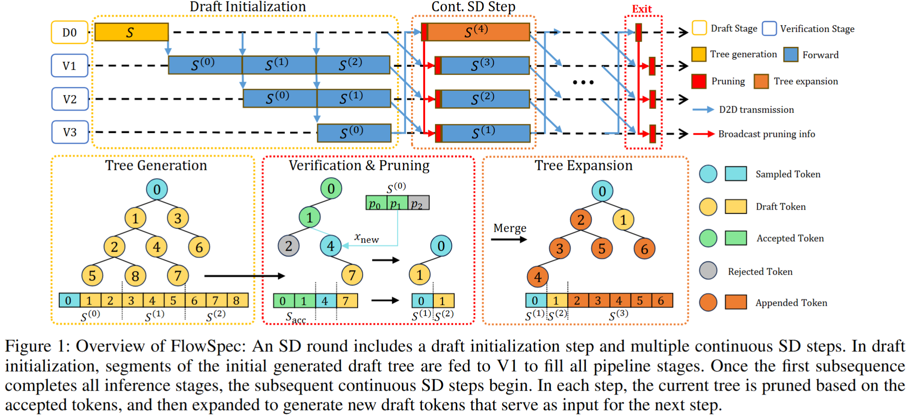
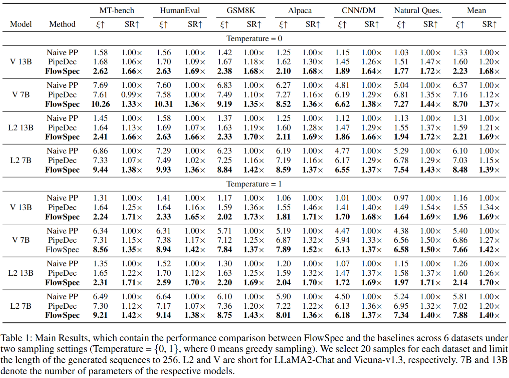

# FlowSpec: Continuous Pipelined Speculative Decoding for Efficient Distributed LLM Inference
This repository is the official implementation of _FlowSpec: Continuous Pipelined Speculative Decoding for Efficient Distributed LLM Inference_

## Brief Introduction
In this work, we propose a continuous pipeline-parallel tree-based speculative decoding framework for distributed inference, called **FlowSpec**, to reduce the inference latency with sparse requests. 
Our framework incorporates a lightweight draft model for token generation and the base LLM for pipeline-parallel verification, which enables the output of multiple tokens in a single forward propagation and hence mitigates the sparse request issue. 


## Requirements

### Basic information

```
jetpack: 5.1.2
cuda: 11.4
python: 3.8
```

### Virtual Environment Setup

```shell
python -m venv flowspec

source ~/venv/flowspec/bin/activate

pip install -r requirements.txt

# Or for Jetson
pip install -r requirements_jetson.txt
```

**Or Conda Environment Setup**

```shell
conda create -n flowspec python=3.8

conda activate flowspec

pip install -r requirements.txt

# Or for Jetson
pip install -r requirements_jetson.txt
```

**Install Torch And Bitsandbytes (Only for Jetson)**

```shell
# Download the torch-1.11.0-cp38-cp38-linux_aarch64.whl from online resources
wget https://nvidia.box.com/shared/static/ssf2v7pf5i245fk4i0q926hy4imzs2ph.whl

pip install torch-1.11.0-cp38-cp38-linux_aarch64.whl

# Install bitsandbytes for Jetson (version 0.41.2)
git clone https://github.com/to-aoki/bitsandbytes.git

cd bitsandbytes

(make sure right configurations for paths of nvcc, cuda, cuda-awared torch...)

CUDA_VERSION=114 make cuda11x

python setup.py install
```


## Quick Start

**First, get split models and configs** on server

Split model: `split_and_save_models.py`

- set proper model path to load model; set target path to save the *state_dict* of the split stage model
- set number of stages and layers
- run `python split_and_save_models.py`
- (Only for distributed test) send the *state_dict* of the split models and the weight of the draft models to the devices

**Then set configurations in**  `config/run_config.py`

- model name, model paths, running methods...

**Finished all above steps**, run `run_pipe.sh` (local test with multi-process) or `run_jetson.sh` (distributed test with multi-machine)

``` shell
# split models and save
python split_and_save_models.py

# set configurations for running
sudo nano config/run_config.py

# run
bash run_pipe.sh
# or
bash run_jetson.sh
```

## Evaluation

To start large scale evaluation, run `run_pipe_eval.sh` or `scripts/run_jetson_eval.sh` for 7B model for local and distributed scenarios, respectively. Set the model configuration via config/run_config.py.

Set `quant` in `run_config.py` to choose the quantization method, if needed.

**model evaluation**
``` shell
# run
bash run_eval.sh
# or
PYTHONPATH=. scripts/bash run_jetson_eval.sh
```

<!-- **13B model evaluation (Quantization is recommended)**
``` shell
# run
bash run_eval_13B.sh
# or
bash run_jetson_eval_13B.sh
``` -->
## TP

For TP evaluation, refer to the tp dir, whose constructure is similar with the main directory. The pipeline type should be "tp" before.
``` shell
# run
PYTHONPATH=. bash tp/run_tp.sh
# eval
PYTHONPATH=. bash tp/run_tp_eval.sh
```
## Pre-trained Models

We use the draft model weights provided by [EAGLE](https://github.com/SafeAILab/EAGLE/tree/main) for evaluation.

- [Vicuna-7B-v1.3](https://huggingface.co/yuhuili/EAGLE-Vicuna-7B-v1.3)
- [Vicuna-13B-v1.3](https://huggingface.co/yuhuili/EAGLE-Vicuna-13B-v1.3)
- [LLaMA2-Chat 7B](https://huggingface.co/yuhuili/EAGLE-llama2-chat-7B)
- [LLaMA2-Chat 13B](https://huggingface.co/yuhuili/EAGLE-llama2-chat-13B)

## Results

Extended Results, which contain the performance comparison between FlowSpec and the
baselines across 6 datasets under two sampling settings (Temperature = 0 or 1, 0 means greedy
sampling). We select 20 samples for each dataset and limit the length of the generated sequences to
128. V and L2 are short for LLaMA2-Chat and Vicuna-v1.3, respectively. 7B and 13B denote the
number of parameters of the respective models.

<!-- | Model    | Method      | Metric       | MT-bench | HumanEval | GSM8K | Alpaca | CNN/DM | Natural Ques. | Mean  | SR↑     |
|----------|-------------|--------------|---------:|----------:|------:|-------:|-------:|--------------:|------:|---------|
| **Temperature = 0** |  |  |  |  |  |  |  |  |  |  |
| V 13B    | Naive PP    | ξ ↑          |     1.58 |      1.56 |  1.42 |   1.25 |   1.15 |         1.03 | 1.33  | 1.00×   |
|          | PipeDec     | ξ ↑          |     1.68 |      1.70 |  1.67 |   1.62 |   1.45 |         1.51 | 1.60  | 1.45×   |
|          | **FlowSpec**| **ξ ↑**      | **2.55** |  **2.54** |**2.35**|**2.05**|**1.82**|     **1.74** |**2.18**|**1.64×**|
| V 7B     | Naive PP    | ξ ↑          |     7.69 |      7.60 |  6.83 |   6.27 |   4.81 |         5.04 | 6.37  | 1.00×   |
|          | PipeDec     | ξ ↑          |     7.61 |      7.58 |  7.49 |   7.27 |   6.19 |         6.81 | 7.16  | 1.12×   |
|          | **FlowSpec**| **ξ ↑**      | **9.88** |  **9.47** |**8.91**|**8.28**|**6.43**|**7.17**     |**8.40**|**1.32×**|
| L2 13B   | Naive PP    | ξ ↑          |     1.45 |      1.58 |  1.37 |   1.25 |   1.12 |         1.13 | 1.31  | 1.00×   |
|          | PipeDec     | ξ ↑          |     1.64 |      1.69 |  1.63 |   1.60 |   1.47 |         1.55 | 1.59  | 1.21×   |
|          | **FlowSpec**| **ξ ↑**      | **2.36** |  **2.52** |**2.26**|**2.10**|**1.82**|**1.92**     |**2.16**|**1.65×**|
| L2 7B    | Naive PP    | ξ ↑          |     6.86 |      7.29 |  6.23 |   6.19 |   4.77 |         5.29 | 6.10  | 1.00×   |
|          | PipeDec     | ξ ↑          |     7.33 |      7.49 |  7.25 |   7.19 |   6.17 |         6.78 | 7.03  | 1.15×   |
|          | **FlowSpec**| **ξ ↑**      | **9.02** | **9.51** |**8.50**|**8.49**|**6.41**|**7.46**     |**8.23**|**1.35×**|
| **Temperature = 1** |  |  |  |  |  |  |  |  |  |  |
| V 13B    | Naive PP    | ξ ↑          |     1.31 |      1.41 |  1.17 |   1.06 |   1.01 |         0.97 | 1.16  | 1.00×   |
|          | PipeDec     | ξ ↑          |     1.64 |      1.64 |  1.59 |   1.55 |   1.41 |         1.49 | 1.55  | 1.34×   |
|          | **FlowSpec**| **ξ ↑**      | **2.24** |  **2.36** |**2.10**|**1.85**|**1.66**|**1.57**     |**1.96**|**1.70×**|
| V 7B     | Naive PP    | ξ ↑          |     6.34 |      6.31 |  5.71 |   5.19 |   4.47 |         4.38 | 5.40  | 1.00×   |
|          | PipeDec     | ξ ↑          |     7.31 |      7.38 |  7.12 |   6.87 |   5.94 |      **6.56**| 6.86  | 1.27×   |
|          | **FlowSpec**| **ξ ↑**      | **8.26** |  **8.71** |**7.88**|**7.37**|**5.96**|        6.32 | **7.42**|**1.37×**|
| L2 13B   | Naive PP    | ξ ↑          |     1.35 |      1.52 |  1.30 |   1.20 |   1.07 |         1.15 | 1.26  | 1.00×   |
|          | PipeDec     | ξ ↑          |     1.65 |      1.70 |  1.63 |   1.59 |   1.47 |         1.58 | 1.60  | 1.26×   |
|          | **FlowSpec**| **ξ ↑**      | **2.32** |  **2.63** |  **2.22**|**2.04**|**1.72**|**1.99**|**2.15**|**1.71×**|
| L2 7B    | Naive PP    | ξ ↑          |     6.49 |      6.64 |  6.10 |   5.90 |   4.50 |         5.24 | 5.81  | 1.00×   |
|          | PipeDec     | ξ ↑          |     7.30 |      7.17 |  7.36 |   7.22 |   6.13 |         6.95 | 7.02  | 1.20×   |
|          | **FlowSpec**| **ξ ↑**      | **8.53** |  **8.90** |**8.37**|**8.01**|**6.14**|**7.31**|**7.88**|**1.36×**| -->



## Acknowledgement
The implementation of FlowSpec reuses the code from [EAGLE](https://github.com/SafeAILab/EAGLE) and refers to [OPT-Tree](https://github.com/Jikai0Wang/OPT-Tree) and [Jupiter](https://github.com/ysyisyourbrother/Jupiter).

## Contributing
coming soon...

